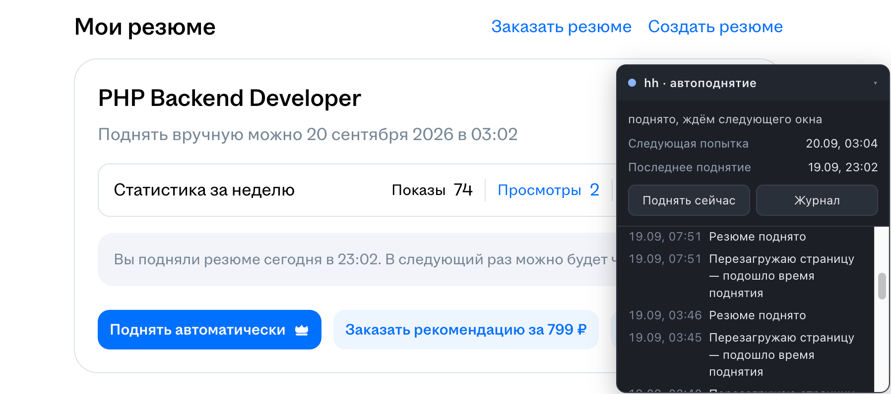
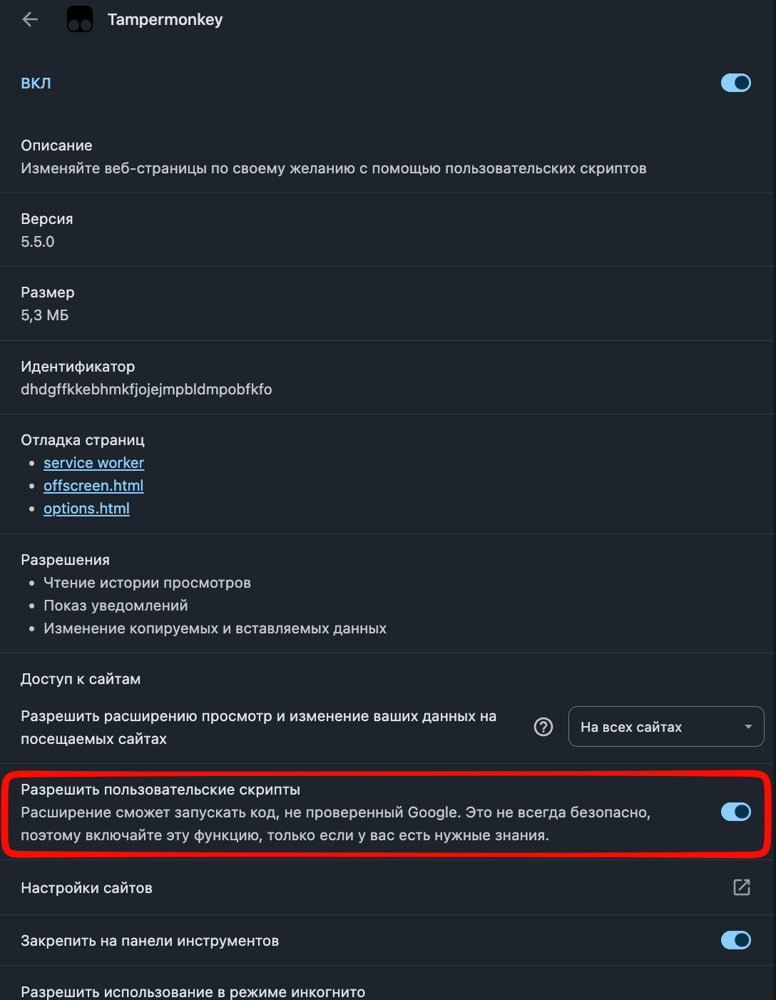

# 🚀 hh-resume-booster

> Userscript, который раз в 4 часа сам нажимает **«Поднять в поиске»** на hh.ru
> и держит резюме в верхних строках выдачи для работодателей.




hh.ru позволяет поднимать резюме в поиске бесплатно, но только вручную и не чаще раза в 4 часа.
Автоматическое поднятие входит в платную подписку hh PRO. Этот скрипт делает то же самое
бесплатно — в твоём обычном Chrome и в твоей же сессии, без серверов, паролей и зависимостей.

---

## ⚡ Установка за 3 шага

**1. Поставить [Tampermonkey](https://chromewebstore.google.com/detail/tampermonkey/dhdgffkkebhmkfjojejmpbldmpobfkfo)**

**2. Разрешить Chrome выполнять userscripts**

`chrome://extensions` → Tampermonkey → **«Сведения»** → включить **«Разрешить пользовательские скрипты»**



> ⚠️ Не пропускай этот шаг. Без него скрипт будет числиться установленным и включённым,
> но на странице молча не запустится — без единой ошибки.

**3. Скопировать скрипт в Tampermonkey**

```sh
git clone https://github.com/UshakovDev/hh-resume-booster.git
cd hh-resume-booster
cat hh-boost.user.js | pbcopy
```

Иконка Tampermonkey → **«Создать новый скрипт…»** → `Cmd+A` → `Cmd+V` → `Cmd+S`

**Готово.** Открой `hh.ru/applicant/profile/me` — в правом нижнем углу появится бейдж.
Нажми в нём «Поднять сейчас», чтобы убедиться, что всё работает, и держи вкладку открытой.

📖 **[Подробная установка и что делать, если не заработало →](docs/installation.md)**

---

## 🎯 Что он умеет

- **Переживает сон ноутбука** — хранит абсолютное время следующей попытки, а не таймер: проспанный слот отрабатывает сразу после пробуждения
- **Не трогает платное** — «Поднять автоматически» и «Заказать рекомендацию за 799 ₽» отсекаются, даже когда занимают место обычной кнопки
- **Не врёт об успехе** — поднятие засчитывается, только если hh это подтвердил; при сомнении скрипт перезагружает страницу и перепроверяет
- **Показывает, что делает** — статус, время следующей попытки и журнал последних 25 событий прямо на странице

📖 **[Как это устроено внутри и как настроить →](docs/how-it-works.md)**

---

## ⚠️ Важно

Автоматизация действий формально расходится с пользовательским соглашением hh.ru. Один клик
раз в 4 часа — очень тихий профиль, но риск лежит на аккаунте владельца. Официальная
альтернатива — подписка **hh PRO**.

Скрипт не собирает и никуда не отправляет данные: всё состояние хранится локально
в хранилище Tampermonkey.

## 📄 Лицензия

[MIT](LICENSE) © Dmitry Ushakov
