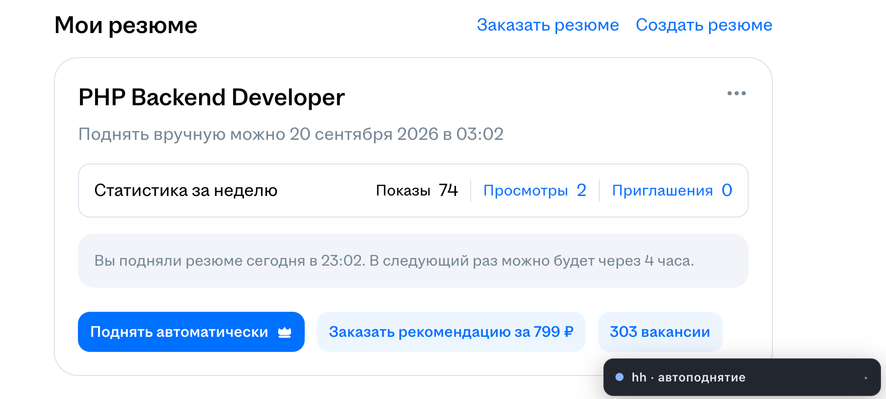

# Как это работает

Разбор механики [`hh-boost.user.js`](../hh-boost.user.js) — что происходит внутри, какие грабли
обойдены и что можно подкрутить.

---

## Общий цикл

Скрипт не висит на странице в ожидании — он работает перезагрузками, потому что кнопка
появляется только в свежей разметке от сервера:

```
03:45  тикер видит, что время подошло   →  location.reload()
03:45  страница загрузилась, ждём гидратации
03:46  клик  →  подтверждение  →  следующая метка на 07:4x
```

Побочная польза от перезагрузки — освежается сессия, так что она не протухает от долгого
простоя вкладки.

---

## Поиск кнопки

Сначала по `data-qa="resume-update-button"`, затем — запасным путём — по видимой надписи среди
`button`, `a` и `[role="button"]`. Два пути нужны потому, что hh регулярно двигает атрибуты
в вёрстке, а текст на кнопке стабилен годами.

**Надпись проверяется в обоих случаях**, и это не перестраховка. Во время четырёхчасового
перерыва hh подставляет на то же место платную «Поднять автоматически» из hh PRO:



Если бы скрипт доверял только `data-qa`, он рано или поздно нажал бы на оплату подписки.
Поэтому любая надпись со знаком `₽`, словами «hh PRO», «подписка», «автоматически» и подобными
отсекается до клика.

---

## Ожидание гидратации

Главная ловушка всего проекта. hh отдаёт страницу с сервера **уже отрисованной**, а React
подключает обработчики событий позже. В промежутке кнопка видна, выглядит рабочей и даже
реагирует на наведение — но клик по ней уходит в пустоту.

Именно на этом скрипт долго притворялся, что работает: он жал кнопку сразу после загрузки,
попадал в мёртвую разметку, а потом React заменял DOM-узел кнопки на новый.

Поэтому теперь скрипт ждёт события `load` и даёт странице ещё несколько секунд осесть
(`HYDRATION_DELAY`).

---

## Клик

Последовательность `mousedown → mouseup → click`, подобранная под дизайн-систему hh (magritte).
Pointer-события убраны намеренно: с `pointerdown`/`pointerup` кнопка не срабатывает.

Два нюанса из практики:

- **Кнопка ищется заново перед каждой попыткой.** React подменяет DOM-узлы, и клик
  по сохранённой ссылке уходит в никуда.
- **События строятся с оглядкой на песочницу.** В Tampermonkey глобальный `window` — прокси,
  а не настоящий `Window`, и Chrome отвергает его в поле `view`: «Failed to convert value
  to 'Window'». Скрипт берёт окно из `document.defaultView`, а если и это не проходит — строит
  событие вообще без `view`.

Если отклика нет, скрипт добивает нативным `.click()` и повторяет весь заход до трёх раз
(`CLICK_ATTEMPTS`).

---

## Подтверждение

Засчитывается **только то, что hh сказал или показал**:

- появилось «Успешно поднято» или «Вы подняли резюме сегодня в …»
- изменилась строка «Обновлено …» в карточке резюме
- возник таймер до следующего поднятия, которого до клика не было

Исчезновение кнопки успехом **не** считается — React убирает узлы и без всякого поднятия,
и раньше скрипт ловил на этом ложное «поднято».

---

## Перепроверка

Если подтверждения нет, скрипт не спешит объявлять неудачу: правду знает только свежая
страница. Он взводит флаг `pendingCheck` и через пару минут перезагружается.

- Кнопка снова активна → клик действительно не сработал, засчитывается неудача, и скрипт
  сразу пробует ещё раз
- Кнопки нет или она погасла → поднятие всё-таки прошло, записывается время и планируется
  следующее окно

---

## Планирование

Скрипт читает со страницы «Поднять вручную можно сегодня в 19:14» и запоминает это как
**абсолютную метку времени**.

Долгих `setTimeout` нет намеренно: во сне ноутбука таймеры замирают и уезжают. Вместо этого
раз в 30 секунд — а также при пробуждении вкладки, возврате фокуса и восстановлении сети —
часы сверяются с меткой. Поэтому проспанный ночью слот отрабатывает сразу после того, как
машина ожила.

К каждому сроку добавляются случайные 0–5 минут, чтобы поднятия не шли по идеально ровной сетке.

---

## Предохранители

- **Свой троттлинг** «не чаще раза в 4 часа 2 минуты» поверх сайтового — скрипт не будет
  долбить кнопку, даже если hh покажет её активной раньше
- **Остановка после трёх неудач подряд**, чтобы при смене вёрстки не молотить перезагрузками.
  Снимается кнопкой «Поднять сейчас»
- **Минимум 5 минут между перезагрузками** — защита от петли
- **Платное не нажимается никогда** — надпись проверяется всегда
- **Сессия слетела** → статус «не авторизован», тихое ожидание с проверкой раз в 15 минут
- **Модалка hh PRO** после поднятия закрывается сама; на работу скрипта она не влияет, потому
  что перед следующим заходом страница всё равно перезагружается

---

## Настройки

Все параметры — в блоке «Настройки» в начале [`hh-boost.user.js`](../hh-boost.user.js):

| Константа | По умолчанию | Назначение |
|---|---|---|
| `MIN_INTERVAL` | 4 ч 2 мин | Собственный троттлинг поверх сайтового |
| `JITTER_MAX` | 5 мин | Случайная добавка ко времени попытки |
| `RETRY_DELAY` | 30 мин | Пауза после неудачной попытки |
| `LOGIN_DELAY` | 15 мин | Пауза, если сессия слетела |
| `MIN_RELOAD_GAP` | 5 мин | Минимум между перезагрузками |
| `TICK` | 30 с | Как часто сверяются часы |
| `WAIT_BUTTON` | 25 с | Ожидание появления кнопки |
| `WAIT_CONFIRM` | 5 с | Ожидание отклика hh после одного нажатия |
| `HYDRATION_DELAY` | 4 с | Пауза после загрузки, пока React оживляет кнопку |
| `CLICK_ATTEMPTS` | 3 | Сколько раз пробовать нажать за один заход |
| `PENDING_RECHECK` | 2 мин | Через сколько перепроверять неподтверждённый клик |
| `MAX_FAILS` | 3 | После скольких неудач подряд остановиться |

---

## Ограничения

- **4–5 поднятий в сутки вместо теоретических 6** — ночные слоты теряются, пока ноутбук спит.
  Чтобы выбирать все шесть, нужен вариант с постоянно работающей машиной
- **Одно резюме.** Скрипт жмёт первую найденную кнопку
- **Нужна открытая вкладка** — это плата за работу в настоящем браузере с настоящей сессией
