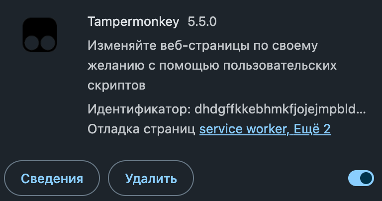
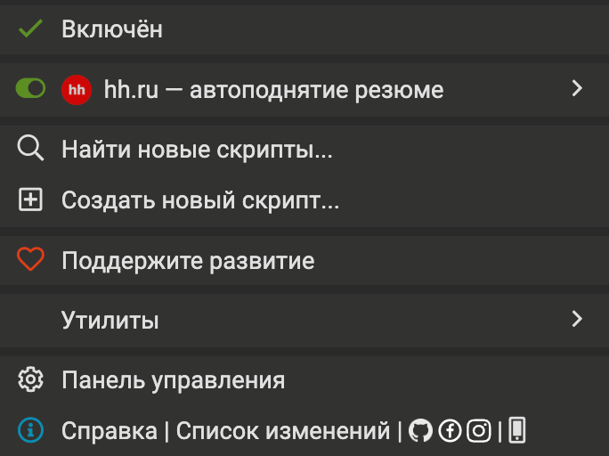

# Установка и первый запуск

Подробная версия [трёх шагов из README](../README.md#-установка-за-3-шага) — со скриншотами
и разбором того, что делать, если не заработало.

---

## Шаг 1. Поставить Tampermonkey

Открой [страницу расширения в Chrome Web Store](https://chromewebstore.google.com/detail/tampermonkey/dhdgffkkebhmkfjojejmpbldmpobfkfo)
→ **«Установить»** → подтверди **«Установить расширение»**. Расширение бесплатное.

Удобно сразу закрепить иконку: кнопка-пазл справа от адресной строки → булавка рядом
с Tampermonkey. Дальше она понадобится не раз.

---

## Шаг 2. Разрешить Chrome выполнять userscripts

**Это самый важный шаг.** Chrome по умолчанию блокирует пользовательские скрипты и делает это
молча: скрипт будет числиться установленным и включённым, а на странице не выполнится, без
единой ошибки. Это самая частая причина «ничего не происходит».

1. Введи в адресной строке `chrome://extensions`
2. Найди карточку Tampermonkey и нажми **«Сведения»**



3. Пролистай до пункта **«Разрешить пользовательские скрипты»** и включи его


4. Перезагрузи уже открытые вкладки hh.ru, если они были

**Нет такого переключателя?** Значит Chrome старее 138-й версии. Включи **«Режим разработчика»**
тумблером в правом верхнем углу `chrome://extensions`, затем вернись в «Сведения» и проверь
пункт ещё раз.

**Проверка:** открой панель Tampermonkey. Если наверху висит красная плашка про developer mode —
шаг не выполнен, скрипты работать не будут.

> В Firefox и Safari такого ограничения нет, там этот шаг не нужен.

---

## Шаг 3. Установить скрипт

Скопируй содержимое [`hh-boost.user.js`](../hh-boost.user.js) в буфер обмена:

```sh
git clone https://github.com/UshakovDev/hh-resume-booster.git
cd hh-resume-booster
cat hh-boost.user.js | pbcopy          # macOS
# xclip -sel clip < hh-boost.user.js   # Linux
```

Дальше:

1. Иконка Tampermonkey → **«Создать новый скрипт…»**
2. Откроется редактор с заготовкой. Выдели всё (`Cmd+A`) и удали
3. Вставь скопированное (`Cmd+V`)
4. Сохрани — `Cmd+S`

> Вставлять нужно **вместе** с блоком `// ==UserScript== … // ==/UserScript==` в начале файла.
> Это не комментарий, а конфигурация: там указано, на каких страницах скрипт запускается
> и какие функции хранения ему доступны. Без неё он не заработает.

### Убедиться, что скрипт включён

Иконка Tampermonkey → в списке должен быть **«hh.ru — автоподнятие резюме»** с зелёным
переключателем:



---

## Первый запуск

1. Открой `https://hh.ru/applicant/profile/me` авторизованным *(hh сам перебросит на твой
   региональный поддомен)*
2. В правом нижнем углу появится бейдж **«hh · автоподнятие»**
3. Нажми **«Поднять сейчас»** — это форсирует попытку, минуя собственный таймер скрипта

| Статус в бейдже | Что значит |
|---|---|
| `поднято, ждём следующего окна` | Всё работает, дальше само |
| `таймер hh ещё идёт` | Кнопка найдена, но 4 часа не прошли. Тоже успех — скрипт видит и кнопку, и таймер |
| `клик без подтверждения — перепроверю…` | hh не ответил. Скрипт сам перезагрузит страницу и выяснит результат |
| `кнопка не найдена` | hh поменял вёрстку — см. ниже |

Дальше просто держи вкладку открытой. Страница будет перезагружаться сама раз в ~4 часа.

---

## Если не работает

### Бейдж вообще не появился

По порядку убывания вероятности:

1. **Не выполнен шаг 2** — Chrome не разрешил userscripts. Проверь `chrome://extensions`
2. **Не тот адрес.** Скрипт привязан к страницам вида `*.hh.ru/applicant/*`. На отдельной
   странице резюме `/resume/<...>` или в поиске вакансий он не запустится. Число активных
   скриптов на вкладке Chrome показывает бейджем на иконке Tampermonkey
3. **Скрипт выключен** в панели Tampermonkey
4. Открой консоль (`Cmd+Option+J`). При каждой загрузке страницы скрипт первым делом пишет
   `[hh-boost] vX.Y.Z загружен: <адрес>`. Нет этой строки — скрипт не запустился, причина
   в пунктах 1–3

### Статус «кнопка не найдена»

hh поменял надпись на кнопке. Посмотри, как она подписана сейчас, и добавь текст в массив
`BOOST_TEXTS` в начале скрипта.

### Скрипт жмёт, но ничего не происходит

В репозитории лежит [`debug-snippet.js`](../debug-snippet.js) — диагностика вёрстки. Вставь его
в консоль на странице профиля: он снимет состояние карточки резюме, отправит такой же клик, как
userscript, через 5 секунд снимет состояние ещё раз и выведет отчёт — html кнопки, что
изменилось после клика и прямой вердикт, работает клик или нет.

```sh
cat debug-snippet.js | pbcopy
```

### Скрипт остановился сам

После трёх неудач подряд скрипт замолкает, чтобы не перезагружать страницу бесконечно.
Снимается нажатием **«Поднять сейчас»** в бейдже.

---

## Обновление

Скрипт установлен копипастом, автообновления у него нет. Чтобы обновиться:

```sh
git pull
cat hh-boost.user.js | pbcopy
```

Иконка Tampermonkey → «Панель управления» → клик по названию скрипта → вкладка **«Редактор»**
→ `Cmd+A` → `Cmd+V` → `Cmd+S`.
